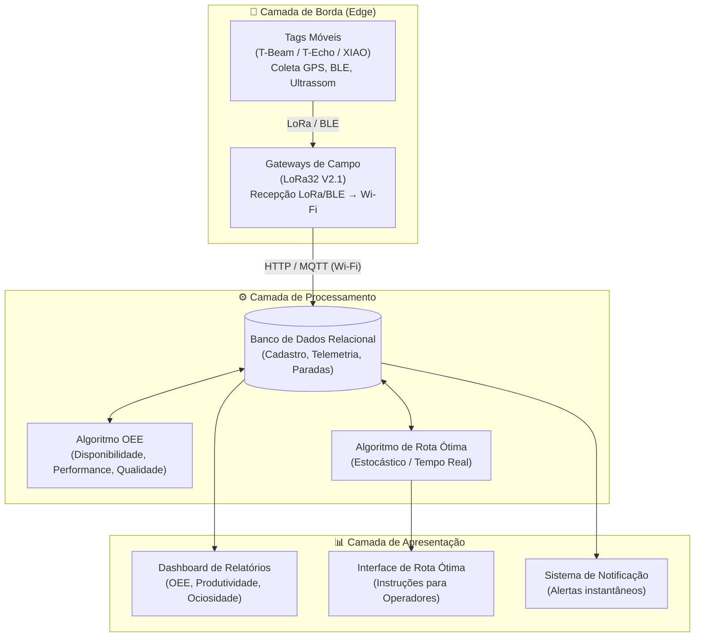

<p align="center">
  <strong>🚢 EMAP — Sistema de Monitoramento em Tempo Real da Área Portuária</strong>
</p>

<p align="center">
  <em>Rastreamento inteligente de ativos móveis no Porto do Itaqui (MA) — IFMA Campus Santa Inês</em>
</p>

<p align="center">
  
  
  
  
  
</p>

---

## 📋 Sumário

- [Sobre o Projeto](#-sobre-o-projeto)
- [Problema e Motivação](#-problema-e-motivação)
- [Objetivos](#-objetivos)
- [Arquitetura do Sistema](#-arquitetura-do-sistema)
- [Hardware Utilizado](#-hardware-utilizado)
- [Macroetapas do Projeto](#-macroetapas-do-projeto)
- [Estrutura do Repositório](#-estrutura-do-repositório)
- [Tecnologias e Ferramentas](#-tecnologias-e-ferramentas)
- [Equipe](#-equipe)
- [Referências Bibliográficas](#-referências-bibliográficas)
- [Licença](#-licença)

---

## 🚀 Sobre o Projeto

Este repositório contém toda a **base de conhecimento** do projeto de pesquisa para o desenvolvimento de um **sistema de coleta de dados em tempo real, análise e comunicação instantânea** dos impactos operacionais decorrentes de paradas ou intercorrências na área portuária do **Porto do Itaqui**, administrado pela **EMAP** (Empresa Maranhense de Administração Portuária).

O projeto é desenvolvido pelo **Instituto Federal do Maranhão (IFMA) — Campus Santa Inês**, com o objetivo de **modernizar os processos de coleta de informações** sobre a movimentação de veículos e equipamentos móveis, substituindo fluxos manuais por análises automatizadas e relatórios em tempo real.

> 📌 A documentação segue o padrão **Google Open Knowledge Format (OKF v0.1)** para permitir navegação tanto por desenvolvedores quanto por agentes de IA.

---

## 🔍 Problema e Motivação

A operação portuária no Porto do Itaqui é um ambiente de alta complexidade e dinamismo. Atualmente, o registro e a comunicação de intercorrências operacionais enfrentam gargalos críticos:

| Desafio | Descrição |
| :--- | :--- |
| **Processos Manuais** | Dependência de e-mails e comunicações verbais para reportar paradas de equipamentos |
| **Atrasos na Tomada de Decisão** | Falta de informações imediatas e estruturadas gera lentidão no realinhamento entre equipes |
| **Subutilização de Recursos** | Ociosidade de equipamentos e atrasos logísticos por falta de visibilidade em tempo real |

### Benefícios Esperados

- 📊 **Decisões Baseadas em Dados** — Medições precisas de OEE e tempos de ciclo dos ativos móveis
- 🗺️ **Otimização de Rotas** — Trajetos ótimos para veículos portuários, mitigando congestionamentos internos
- 📡 **Comunicação em Tempo Real** — Intercorrências registradas e notificadas instantaneamente
- 🔄 **Modelo Replicável** — Arquitetura aberta que pode servir de referência para outros portos brasileiros

---

## 🎯 Objetivos

### Objetivo Geral

Desenvolver um sistema de coleta de dados em tempo real, análise e processamento, com registro e comunicação instantânea dos impactos operacionais decorrentes de paradas ou intercorrências na área portuária.

### Macroetapas

1. **Sensoriamento com Geolocalização** — Tags de rastreamento com LoRa, BLE e GNSS/GPS
2. **Monitoramento e Coleta em Tempo Real** — Protocolos de comunicação eficientes para telemetria
3. **Banco de Dados Dedicado** — Repositório centralizado de cadastro, sensoriamento e paradas
4. **Algoritmos Operacionais** — Cálculo de OEE e geração de rotas ótimas de tráfego
5. **Sistema de Notificação** — Canais de comunicação em massa para alertas de paradas
6. **Dashboards Interativos** — Interfaces visuais de KPIs para gerência e supervisores

---

## 🏗️ Arquitetura do Sistema

O sistema é composto por **três camadas** que operam de forma integrada:



### Detalhamento das Camadas

| Camada | Função | Componentes |
| :--- | :--- | :--- |
| **Borda (Edge)** | Coleta de dados nos ativos portuários | Tags móveis (GPS/BLE/Ultrassom) + Gateways LoRa |
| **Processamento** | Armazenamento e inteligência operacional | Banco de dados relacional + Algoritmos OEE e Roteamento |
| **Apresentação** | Visualização e alertas em tempo real | Dashboards gerenciais + Sistema de notificações |

---

## 🔧 Hardware Utilizado

O projeto avalia e utiliza **quatro placas de desenvolvimento** com diferentes capacidades de comunicação sem fio:

| Placa | MCU | Comunicação | Diferencial |
| :--- | :--- | :--- | :--- |
| **[LILYGO LoRa32 V2.1](hardware/lilygo_lora32.md)** | ESP32 | LoRa SX1276 + Wi-Fi + BLE | Display OLED 0.96" + Leitor SD — ideal como **Gateway** |
| **[Seeed XIAO nRF54L15](hardware/seeed_xiao_nrf54l15.md)** | Arm Cortex-M33 + RISC-V | Bluetooth 6.0 | Ultra compacta (21×17.8mm) — ideal como **tag BLE** |
| **[LILYGO T-Beam V1.2](hardware/lilygo_t_beam.md)** | ESP32 | LoRa SX1276/78 + GPS NEO-6M | GPS integrado + suporte Meshtastic — ideal como **tag outdoor** |
| **[LILYGO T-Echo](hardware/lilygo_t_echo.md)** | nRF52840 | LoRa SX1262 + BLE + GPS | Ultra baixo consumo + E-Paper — ideal para **monitoramento contínuo** |

---

## 📅 Macroetapas do Projeto

O projeto tem duração de **2 anos**, distribuído em trimestres:

```
Ano 1                                    Ano 2
 T1      T2      T3      T4      T1      T2      T3      T4
┌───────┬───────┬───────┬───────┬───────┬───────┬───────┬───────┐
│▓▓▓▓▓▓▓│▓▓▓▓▓▓▓│       │       │       │       │       │       │ Planejamento e Levantamento
│       │▓▓▓▓▓▓▓│▓▓▓▓▓▓▓│       │       │       │       │       │ Infraestrutura e Aquisições
│       │       │▓▓▓▓▓▓▓│▓▓▓▓▓▓▓│▓▓▓▓▓▓▓│▓▓▓▓▓▓▓│       │       │ Protótipos e Maquete 3D
│       │       │▓▓▓▓▓▓▓│▓▓▓▓▓▓▓│▓▓▓▓▓▓▓│▓▓▓▓▓▓▓│       │       │ Desenvolvimento de Software
│       │       │       │       │       │       │▓▓▓▓▓▓▓│       │ Validação e Implantação
│       │▓ ▓ ▓ ▓│▓ ▓ ▓ ▓│       │▓ ▓ ▓ ▓│▓ ▓ ▓ ▓│▓ ▓ ▓ ▓│       │ Congressos e Publicações
└───────┴───────┴───────┴───────┴───────┴───────┴───────┴───────┘
```

> 📎 Para o cronograma detalhado por trimestres, consulte [`timeline.md`](organization/timeline.md).
> Para o acompanhamento operacional com tarefas rastreáveis, consulte [`schedule.md`](organization/schedule.md).

---

## 📁 Estrutura do Repositório

```
EMAP/
├── README.md                          ← Este arquivo
├── index.md                           ← Índice geral da base de conhecimento (OKF)
├── log.md                             ← Histórico de atualizações do repositório
│
├── objectives/                        ← Objetivos e escopo do projeto
│   ├── index.md
│   ├── scope.md                       ← Objetivo geral e macroetapas
│   └── justification.md              ← Contexto operacional e relevância
│
├── organization/                      ← Planejamento e equipe
│   ├── index.md
│   ├── timeline.md                    ← Cronograma geral (2 anos / trimestres)
│   ├── schedule.md                    ← Cronograma operacional (tarefas rastreáveis)
│   └── team.md                        ← Equipe executora e currículos Lattes
│
├── hardware/                          ← Especificações técnicas de hardware
│   ├── index.md
│   ├── lilygo_lora32.md               ← ESP32 + LoRa SX1276
│   ├── lilygo_t_beam.md               ← ESP32 + LoRa + GPS
│   ├── lilygo_t_echo.md               ← nRF52840 + LoRa SX1262 + E-Paper
│   └── seeed_xiao_nrf54l15.md         ← Cortex-M33 + BLE 6.0
│
├── software/                          ← Arquitetura de software
│   ├── index.md
│   └── system_architecture.md         ← Fluxo de dados e camadas do sistema
│
├── research/                          ← Base de pesquisa
│   ├── index.md
│   ├── references.md                  ← Referências bibliográficas acadêmicas
│   └── links.md                       ← Links úteis (SDKs, firmwares, APIs)
│
└── experiments/                       ← Testes e validações
    ├── index.md
    └── indoor_positioning.md          ← Mapeamento indoor com ultrassom
```

---

## 🛠️ Tecnologias e Ferramentas

### Comunicação Sem Fio

| Tecnologia | Uso no Projeto | Alcance Típico |
| :--- | :--- | :--- |
| **LoRa (SX1276 / SX1262)** | Transmissão de telemetria de longo alcance | 2–15 km (outdoor) |
| **Bluetooth Low Energy (BLE)** | Detecção de proximidade entre ativos | 10–100 m |
| **GNSS / GPS (NEO-6M / L76K)** | Posicionamento outdoor dos veículos | Global |
| **Ultrassom** | Posicionamento indoor em maquete de testes | 1–5 m |

### Protocolos e SDKs

| Ferramenta | Descrição |
| :--- | :--- |
| [Meshtastic](https://meshtastic.org/docs/introduction) | Firmware de rede mesh LoRa para T-Beam e T-Echo |
| [RadioLib](https://github.com/jgromes/RadioLib) | Biblioteca RF para controle direto dos chips Semtech |
| [nRF Connect SDK](https://www.nordicsemi.com/Products/Development-software/nRF-Connect-SDK) | SDK Nordic para nRF52840 e nRF54L15 |
| [ESP-IDF](https://github.com/espressif/esp-idf) | Framework IoT da Espressif para ESP32 |
| [Zephyr RTOS](https://zephyrproject.org/) | Sistema operacional de tempo real para múltiplas MCUs |

### Indicadores Operacionais

| Indicador | Fórmula |
| :--- | :--- |
| **OEE** | Disponibilidade × Performance × Qualidade |
| **Disponibilidade** | Tempo Operacional Real ÷ Tempo Programado |
| **Performance** | Velocidade Real ÷ Capacidade Nominal |
| **Qualidade** | Movimentações Corretas ÷ Total de Movimentações |

---

## 👥 Equipe

| Função | Nome | Titulação | Instituição |
| :--- | :--- | :--- | :--- |
| **Coordenador Geral** | [Ernesto Franklin Marçal Ferreira](https://lattes.cnpq.br/1471302586996212) | Dr. em Automação e Controle | IFMA Campus Santa Inês |
| **Vice-Coordenador** | [Sadoc Fonseca Rocha Filho](http://lattes.cnpq.br/3143531215302528) | Me. em Matemática | IFMA Campus Pedreiras |
| **Pesquisador** | [Leonardo Espindola Fonseca Rocha](http://lattes.cnpq.br/8635314833587192) | Esp. em Eng. Portuária | Pesq. de Hardware e Integração |

---

## 📚 Referências Bibliográficas

1. **SINK, D. S.; TUTTLE, T. C.** *Planejamento e Medição para Performance.* Qualitymark Editora, 1993.
2. **PALOMINO, R.** *A Eficiência Global de Equipamentos (OEE) como Indicador em Operações Portuárias.* ENEGEP, 2018.
3. **ABNT.** *NBR ISO 9001:2015 — Sistemas de Gestão da Qualidade.* Rio de Janeiro, 2015.
4. **COLLYER, M. A.; COLLYER, W. O.** *Dicionário de Comércio Marítimo.* Editora Lutência, 2002.
5. **SILVA, L. A. T.** *Logística no Comércio Exterior.* Aduaneiras, 2004.
6. **ALFREDINI, P.** *Obras e Gestão de Portos e Costas.* Editora Edgard Blucher, 2005.

> 📎 Referências completas com aplicação ao projeto disponíveis em [`references.md`](research/references.md).

---

## 📄 Licença

Este projeto é parte de uma pesquisa acadêmica do **IFMA** em cooperação com a **EMAP**. Para informações sobre uso e reprodução, entre em contato com os coordenadores do projeto.

---

<p align="center">
  <strong>IFMA Campus Santa Inês</strong> · Empresa Maranhense de Administração Portuária (EMAP)<br/>
  <em>Porto do Itaqui — São Luís, Maranhão, Brasil</em>
</p>
