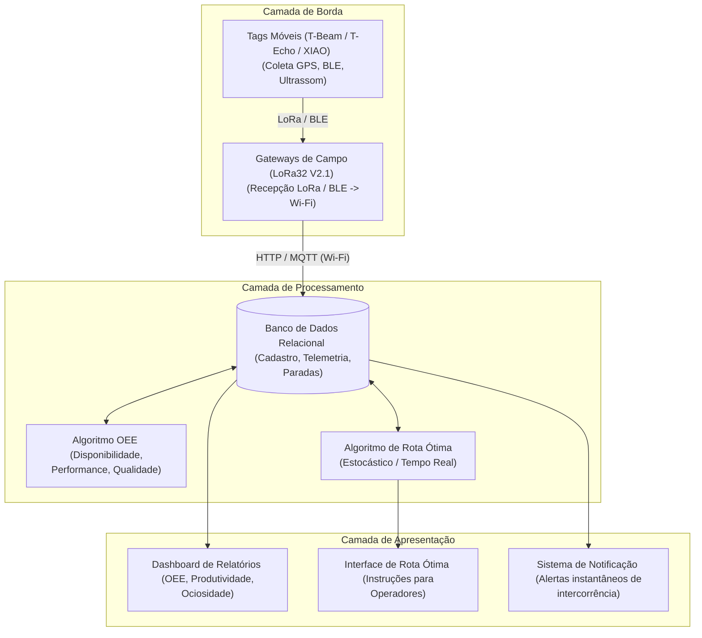

# Arquitetura Lógica do Sistema

Este documento descreve o fluxo de dados e os módulos lógicos que compõem o sistema de monitoramento em tempo real das intercorrências operacionais na área do porto de Itaqui (EMAP).

## Visão Geral do Fluxo de Informação

O sistema divide-se em três camadas principais:
1.  **Camada de Sensoriamento e Borda (Edge)**: Dispositivos móveis instalados nos ativos portuários (carros e equipamentos) e Gateways receptores.
2.  **Camada de Servidor e Processamento**: Servidores de armazenamento de dados e execução de algoritmos operacionais.
3.  **Camada de Apresentação e Controle**: Dashboards gerenciais e sistemas de alerta.

---

## Detalhamento dos Componentes

### 1. Camada de Borda (Tags e Gateways)
*   **Tags Móveis**: Acopladas nos carros e guindastes. Coletam coordenadas GPS/GNSS (outdoor) ou coordenadas ultrassônicas (indoor/maquete), calculando velocidade e status de ignição. Utilizam BLE para detectar a proximidade de tags de equipamentos vizinhos.
*   **Gateways**: Espalhados pela planta do porto. Recebem as transmissões de rádio (LoRa) em longo alcance das tags móveis e empacotam esses dados, repassando-os via rede local Wi-Fi ou ethernet corporativa para o servidor.

### 2. Camada de Servidor (Armazenamento e Inteligência)
*   **Banco de Dados**: Armazena a telemetria histórica de cada ativo, cadastro de operadores e turnos, além do registro manual/automático de intercorrências portuárias (ex: paradas por quebra de correia transportadora, espera de berço de navio).
*   **Algoritmo OEE (Eficiência Global de Equipamentos)**:
    *   *Disponibilidade*: Tempo de operação real vs. tempo de operação programado.
    *   *Performance*: Velocidade real de carga/movimentação vs. capacidade nominal.
    *   *Qualidade*: Movimentações corretas de carga vs. retrabalhos logísticos.
*   **Algoritmo de Rota Ótima**: Calcula o trajeto terrestre mais curto ou mais rápido para veículos de transporte interno do porto, considerando congestionamentos dinâmicos e intercorrências temporárias nos cruzamentos ferroviários.

### 3. Camada de Apresentação (Interfaces)
*   **Painéis Gerenciais**: Gráficos dinâmicos que demonstram gargalos de tempo de parada e ociosidade física.
*   **Notificações Instantâneas**: Disparo de e-mails, SMS ou mensagens de chat para supervisores de turno assim que um equipamento móvel crítico interrompe suas atividades por mais de 5 minutos sem justificativa pré-programada.
